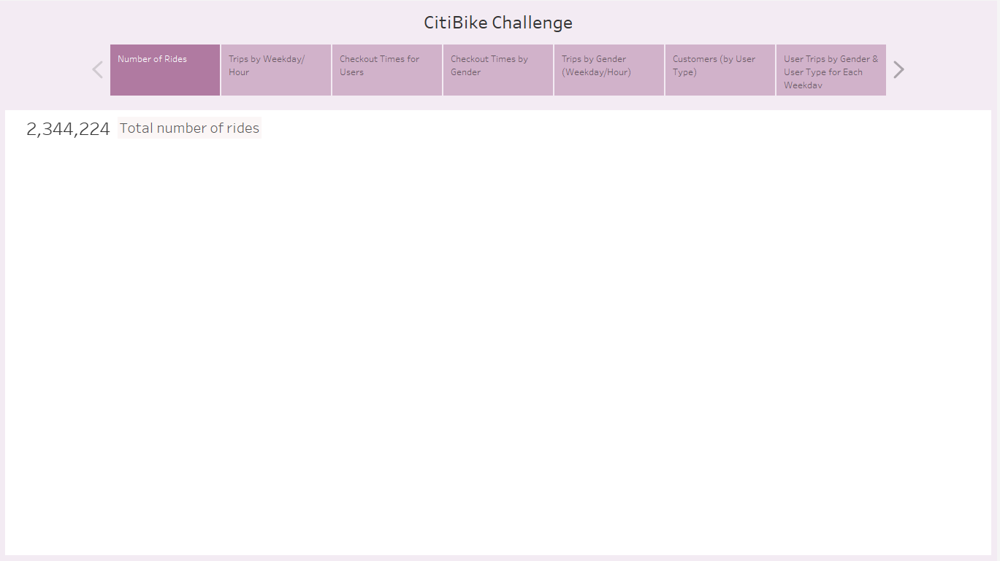
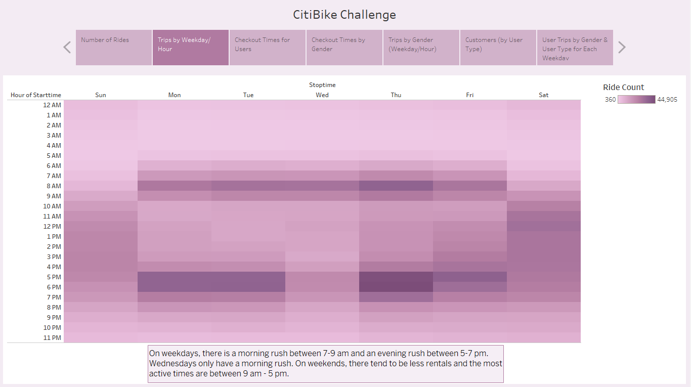
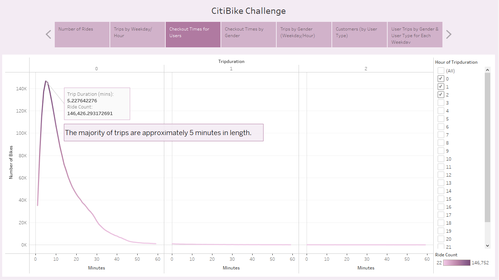
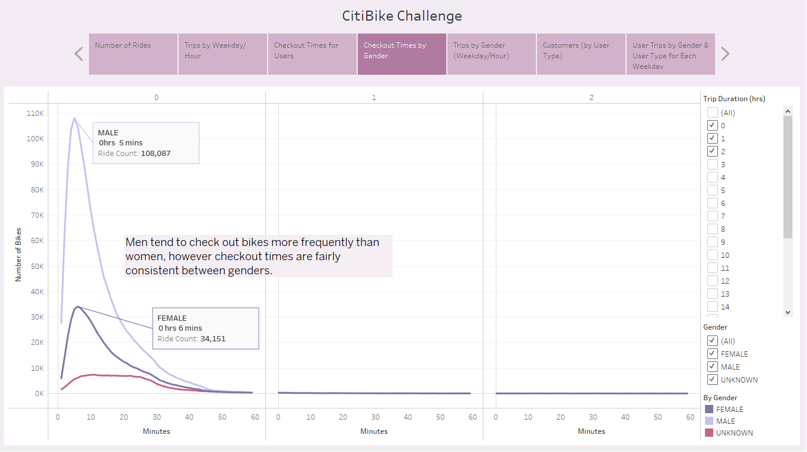
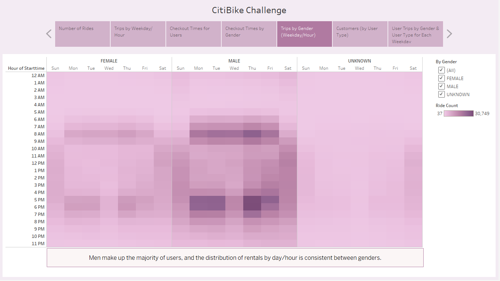
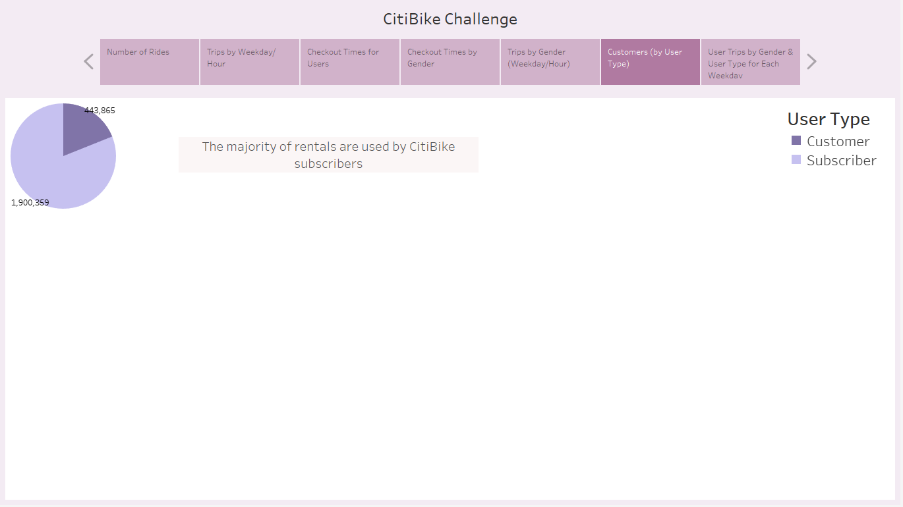
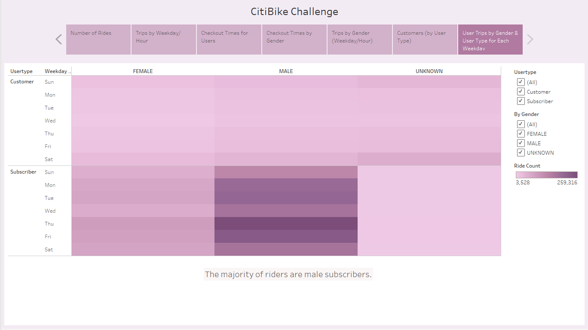

# CitiBike Challenge
## Overview of Analysis
The purpose of this analysis was to review CitiBike data from NYC to build a business proposal for investors to fund a bike-sharing program in Des Moines.

[link to Tableau story](challenge.twb)

# Results
## *Viz 1- Total Number of Rides*
The total number of rides in the NYC dataset was **2,344,224**.

## *Viz 2 - Trips by Weekday/Hour*
There is generally a morning rush between 7-9 am and an evening rush between 5-7 pm for bike rentals on weekdays, suggesting the majority of rentals are for people commuting to and from work. On weekends there are less overall rentals, the majority of which are checked out between 10 am and 7 pm.

## *Viz 3 - Checkout Times for Users*
The majority of trips are approximately 5 minutes long. The rest of the trips are typically between 5-30 minutes in length. Trips between 30-60 minutes are far less common.

## *Viz 4 - Checkout Times by Gender*
Far more males (108,087) rent bikes versus females (34,151), however the duration of rides appears fairly consistent between genders.

## *Viz 5 - Trips by Genders (Weekday/Hour)*
Men make up the majority of users, however the pattern of rentals by day/time appears consistent between genders.

## *Viz 6 - Customers by Type*
Most rentals are used by subscribers (1,900,359) versus nonsubscribers (443,865).

## *Viz 7 - User Trips by Gender & User Type*
The majority of riders on any given day are male subscribers. Female subscribers follow the same pattern of rides as male subscribers for any given day, just with a lower overall ride count. 

Subscribers tend to utilize rentals more frequently Mon-Fri corresponding with commute times, whereas nonsubscribers appear to utilize rentals more frequently on weekends.

# Summary
The results suggest the majority of bike-sharing users will utilize the service to commute to and from work. Furthermore, it appears men more frequently use CitiBike versus women. Since the service is primarily used for commuting, frequent users are likely to subscribe to the service. Nonsubscribers are more likely to utilize the service on weekends, presumably for leisure activities. 

Two additional visualizations could be 1. Subscribers vs Nonsubscribers start times & day of the week, and 2. Subscribers vs Nonsubscribers trip duration for each day of the week.